# FPVDash

A full-screen telemetry dashboard for EdgeTX colour radios, for Betaflight quads on ExpressLRS or Crossfire. Everything you need before, during and after a flight on one screen, with a find-my-quad QR code, a logbook and optional voice callouts.

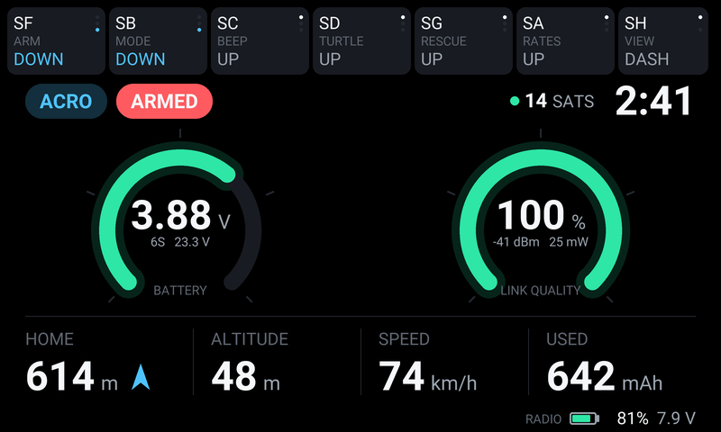

## Features

- **Dashboard**: battery (volts per cell, cell count detected automatically) and link quality gauges, flight mode, arm state, GPS satellites, flight timer, distance and arrow home, altitude, speed and mAh used.
- **Arm state that explains itself**: READY, CAN'T ARM or NO RESCUE while disarmed, and NO HOME in red if you arm before Betaflight can set a GPS Rescue home point.
- **Switch strip** across the top: every switch and knob that drives a channel, with the channel's name and its live position. Built from your model automatically, or with your own labels.
- **Radio battery** in the bottom right corner of every screen.
- **GPS view**, **flight summary** and **link lost** screens with a compass needle from home to the quad.
- **Find my quad**: the last known position as a QR code. Scan it with your phone and the map opens at the spot. It survives a radio restart.
- **Logbook**: flights and hours per quad and the latest flights. Bench tests with the props off aren't counted.
- **Simulator mode** for models used as a USB joystick.
- Optional **voice callouts** (GPS ready, no home point, too high, distance every 100 m, battery 50/70/80% used, pack not charged, status readout) and **RGB LED** effects on radios that have them.

## Screens

Every page, rendered from the widget code at 800x480.

| | |
|---|---|
| 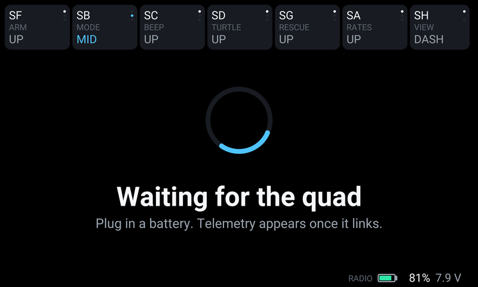 **Waiting.** Before a quad links. The switch strip is already live, so you can check every switch before plugging in. |  **Dashboard.** Armed and flying: pack and link gauges, mode, satellites, timer, and home distance with an arrow pointing home. |
| 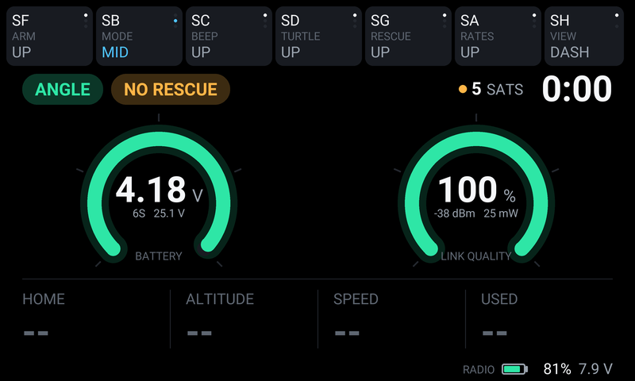 **On the bench.** Disarmed; the chip says why it isn't ready. Here NO RESCUE: too few satellites for a GPS Rescue home point yet. | 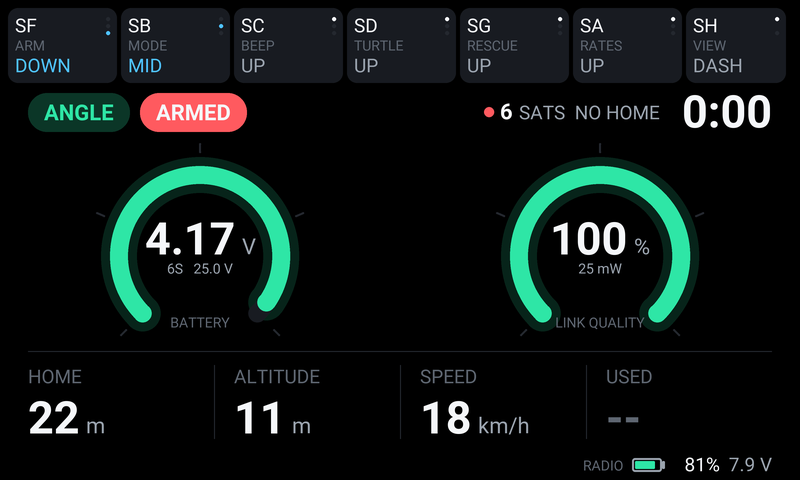 **No home point.** Armed with 6 satellites, so Betaflight set no rescue home: NO HOME in red. |
| 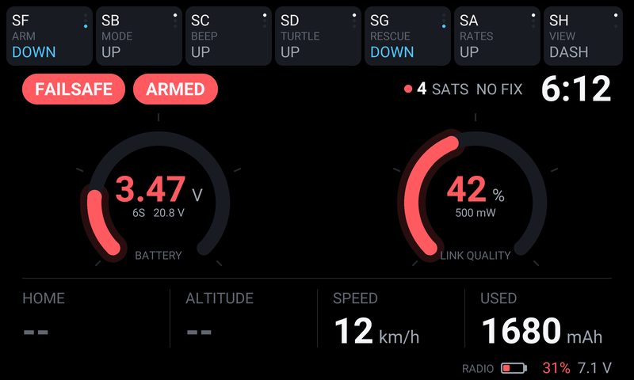 **Warnings.** Failsafe, a sagging pack, a weak link and a low radio battery, all in red. | 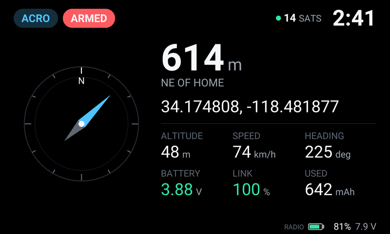 **GPS view.** Press the view switch while flying: compass needle from home, live position, altitude, speed, heading. |
| 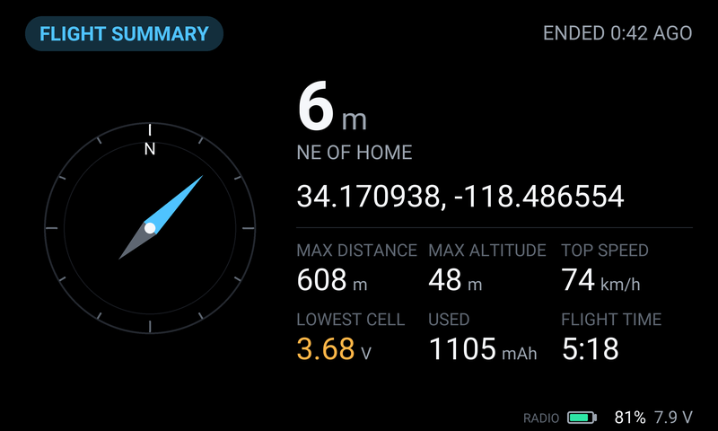 **Flight summary.** After landing: last position, distance and direction from home, max distance, altitude, speed, lowest cell, mAh, flight time. | 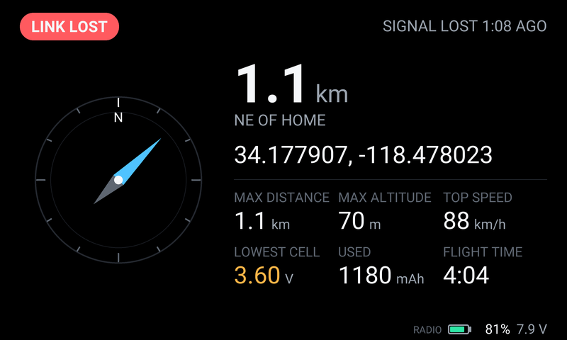 **Link lost.** When the signal drops in the air: where the quad was last seen and how long ago. |
| 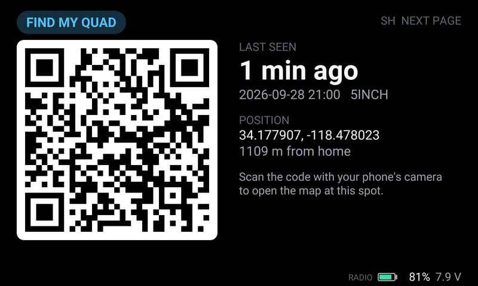 **Find my quad.** The last known position as a QR code for your phone's map. | 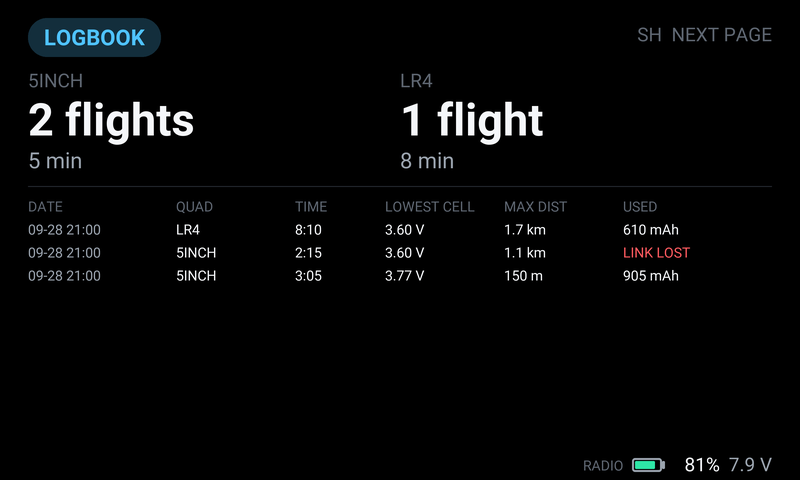 **Logbook.** Flights and hours per quad, and the latest flights. |
| 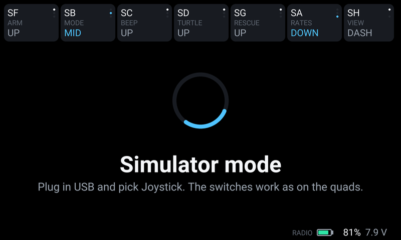 **Simulator mode.** When the model has no RF module switched on. | 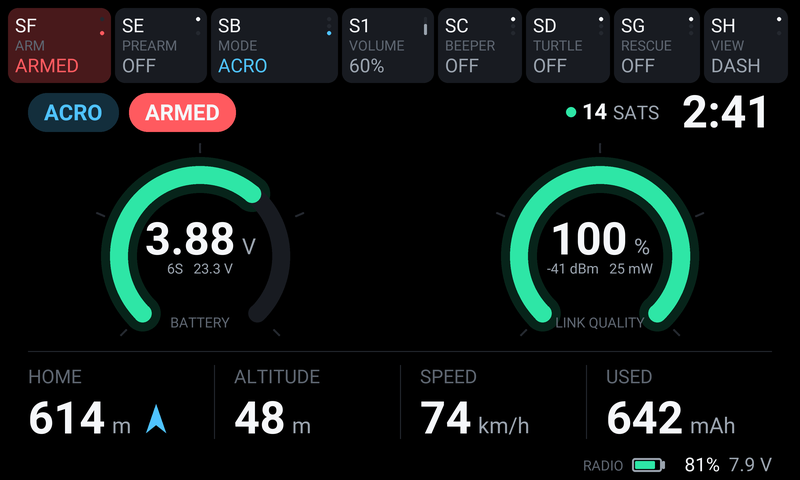 **Your own switch labels.** Named positions from `config.lua`; live states tint the tile. |
| 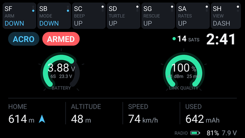 **Smaller screens.** The same dashboard scaled to 480x272 (TX16S MKII and similar). | |

## Requirements

- EdgeTX 2.11 or later on a colour-screen radio. Designed at 800x480 (RadioMaster TX16S MK3) and scales to 480x272.
- Betaflight with ExpressLRS or Crossfire telemetry. Tested with Betaflight 4.5, 2025.12 and 2026.6 on ExpressLRS 4.1.

## Install

1. Download `FPVDash-<version>.zip` from the [latest release](https://github.com/vcazan/fpvdash/releases/latest). The same zip is also in [`dist/`](dist/).
2. Connect the radio by USB and choose **USB Storage**. Unzip the file onto the root of the SD card, merging with the folders already there (`WIDGETS`, `SCRIPTS`, `SOUNDS`). Eject the SD card and unplug.
3. On the radio, open the screen setup (the TELE key on a TX16S), add a screen or pick one, choose the **Full screen** layout, turn off Top bar, Flight mode, Sliders and Trims, then set the widget to **FPVDash**.

That's all the dashboard needs. The switch strip is built from the model's mixer, and flights go into the logbook under the model's name.

### Voice callouts (optional)

In the model's **Special Functions**, add: switch **ON**, function **Lua Script**, script **fpvcall**, repeat **On**. For the battery percentage callouts, list your pack capacities in the settings.

### LEDs (optional)

In the model's **Special Functions**, add: switch **ON**, function **RGB LEDs**, script **fpvleds**, repeat **On**. The stick LEDs turn white when armed and red when not. On a TX16S MK3, the six buttons chase while waiting for telemetry and then show GPS satellites; they only take these colours when the model's customizable switches SW1 to SW6 have **Lua override** turned on for their on and off colours.

## Using it

- The **view switch** (SH by default, a momentary switch) steps through the pages: dashboard and GPS view while linked; otherwise the home screen, Find and Logbook.
- The widget's **Cells** option forces a cell count; 0 detects it from the pack voltage.

## Settings

Copy `WIDGETS/FPVDash/config.example.lua` to `config.lua` in the same folder on the SD card and edit it. Anything you leave out keeps its default, and the file explains each setting:

- `cells`: the pack sizes you fly (default 4 and 6).
- `quadNames`: logbook names by cell count, instead of the model name.
- `homeSats`: Betaflight's `gps_rescue_min_sats` (default 8).
- `viewSwitch`: the page switch (default `"sh"`).
- `switches`: your own switch strip with named positions (ANGLE, HORIZON, ACRO...), instead of the automatic one.
- `ceiling`, `charged`, `packs`, `statusSwitch`: for the voice callouts.

Restart the radio (or reselect the model) after changing it.

## Files it writes

In `/LOGS` on the SD card: `fpvdash-lastpos.txt` (a line per link loss or landing, used by the Find page), `fpvdash-flights.csv` (every flight) and `fpvdash-logbook.txt` (totals and the latest flights).

## Upgrading

Unzip the new version over the old one. Your `config.lua` and logbook are kept, because the zip doesn't contain them. If the radio still shows the old version, delete `WIDGETS/FPVDash/main.luac` so EdgeTX recompiles it.

## Uninstalling

Delete `WIDGETS/FPVDash`, `SCRIPTS/FUNCTIONS/fpvcall.lua`, `SCRIPTS/RGBLED/fpvleds.lua`, `SOUNDS/en/fpvdash` and, if you like, the `fpvdash-*` files in `/LOGS`.

## Making a release

The files that go on the SD card are in [`src/`](src/). To release a new version, bump `VERSION` in `src/WIDGETS/FPVDash/main.lua`, add it to [CHANGELOG.md](CHANGELOG.md) and run `python3 build.py`, which writes `dist/FPVDash-<version>.zip`.

## License

MIT, see [LICENSE](LICENSE).
